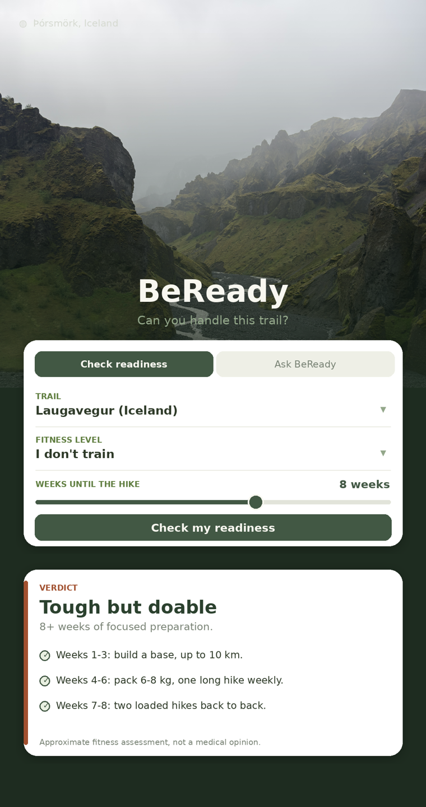

# BeReady

**Can you handle this trail?** BeReady is an honest AI assistant that tells first-time hikers whether they can handle a specific trail and exactly how to prepare.

<p align="center">
  
</p>

Live app: https://bereadyapp.streamlit.app

Built as an AI product engineering project, part of an MSc in Product Management and AI. The goal was not to wrap a chatbot around a prompt, but to design an AI system that stays honest and refuses to guess.

## What it does

A first-time hiker tells BeReady the trail, their training level, and how many weeks they have. BeReady returns one clear verdict, ready, almost ready, tough but doable, or too soon, along with a concrete week-by-week preparation plan. If it does not have verified data on a trail, it says so instead of making something up.

## Why "honest"

Most AI assistants are happy to sound confident about anything. For a product that affects a real decision on a real mountain, that is a problem. BeReady is built around three honesty rules:

- **The verdict is computed, not generated.** Readiness comes from a deterministic function with typed inputs and a clear contract, so it cannot be hallucinated. The model only decides when to call it.
- **It refuses on unknown trails.** If a trail is not in the verified database, BeReady asks for real data instead of guessing.
- **It knows its limits.** BeReady gives fitness readiness, not medical advice, and defers to a doctor for injuries or conditions.

## How the AI is designed

- **Deterministic readiness tool.** The core logic (`readiness_score` / `readiness_from_text`) takes the trail, fitness level, and time available and returns a verdict plus a plan. Typed inputs, a clear docstring, no model in the loop for the number itself.
- **Two answer modes in the chat.** The default is a single Gemini agent with the deterministic readiness tool: fast, cheap, and reliable. A second mode runs a real Agno team of three agents, a Researcher that gathers verified facts (and can web-search time-sensitive ones such as whether a trail is open this season), an Analyst that interprets them, and a reasoning coordinator that writes the final answer. In both modes the verdict still comes only from the deterministic tool, so it cannot be hallucinated.
- **A hard safety boundary.** Questions about injuries, pain, or medical conditions are routed to a clear "see a doctor" response, not a readiness score.
- **Framework migration as a proof point.** The readiness tool was ported from LangChain to Agno almost unchanged. That showed the framework is a wrapper, and the real product lives in the tool, the prompt, and the data.

## Stack

- Python
- Streamlit (interface, deployed on Streamlit Community Cloud)
- Google Gemini (LLM)
- Agno (agent framework)

## How it is built

The app has two modes:

- **Check readiness.** A deterministic form. Runs instantly, needs no API key, and cannot hallucinate.
- **Ask BeReady.** A chat with two answer modes. *Single agent*: one Gemini agent reads a free-form question and calls the same deterministic readiness tool. *Agent team*: a Researcher gathers facts, an Analyst interprets them, and a reasoning coordinator writes the final answer. Both need a `GOOGLE_API_KEY`; the form works without one. The single agent is the default because it does not depend on several model calls.

This split means the core readiness check keeps working even with the model off.

## Run it locally

```bash
pip install -r requirements.txt
streamlit run app.py
```

To enable the chat tab, set a Google Gemini API key:

```bash
export GOOGLE_API_KEY=your_key_here
```

On Streamlit Community Cloud, add `GOOGLE_API_KEY` under Manage app, Secrets.

## Project structure

```
app.py                  Streamlit app: deterministic form + Gemini-backed chat
hero.jpg                Hero banner photo (Þórsmörk, Iceland)
preview.png             App preview used in this README
requirements.txt        streamlit, agno, google-genai
.streamlit/config.toml  Theme (Icelandic highlands palette)
```

## Notes

Trail data currently covers a small set of verified routes (Laugavegur, Fimmvorduhals, Trolltunga, Besseggen, Preikestolen). Adding a trail means adding verified length, elevation, and difficulty, not letting the model estimate it. That is the point.
